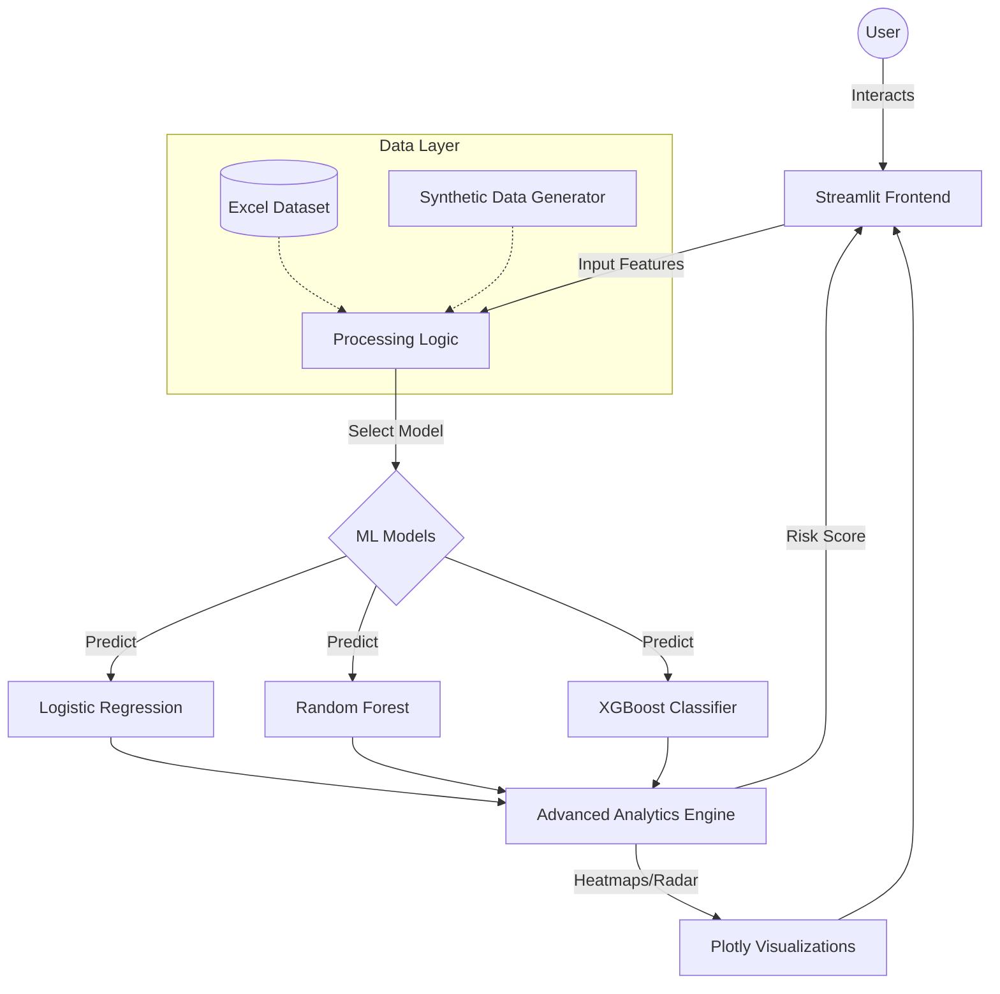

# 🛡️ FinShield AI: Bankruptcy Prediction Engine

FinShield is an advanced, machine learning-powered financial risk assessment dashboard designed to predict corporate bankruptcy with high precision. By analyzing key financial indicators, FinShield provides investors, banks, and stakeholders with real-time, data-driven insights into a company's financial health.

## 🚀 Key Features

- **Multi-Model Prediction**: Compare results across **XGBoost**, **Random Forest**, and **Logistic Regression**.
- **Interactive Risk Profile**: Visual radar charts comparing company risk against industry averages.
- **Sensitivity Analysis Heatmap**: Understand how the interaction between two different risk factors (e.g., Financial Flexibility vs. Management Risk) impacts overall bankruptcy probability.
- **Monte Carlo Simulations**: Run 1,000+ simulations to understand the statistical distribution of risk.
- **Real-time "What-If" Scenarios**: Adjust financial indicators via sliders and see instant updates to risk scores and visualizations.
- **Premium UI/UX**: Built with a custom glassmorphism design system, Lottie animations, and interactive feedback loops.

## 🏗️ Project Architecture



## 🛠️ Tech Stack

- **Frontend**: Streamlit, Custom CSS (Glassmorphism), Lottie Animations
- **Machine Learning**: Scikit-Learn, XGBoost, Joblib
- **Data Science**: Pandas, NumPy
- **Visualizations**: Plotly, Matplotlib
- **Language**: Python 3.10+

## 📥 Installation & Setup

1. **Clone the repository**:
   ```bash
   git clone https://github.com/sujal971/FinShield.git
   cd FinShield
   ```

2. **Install dependencies**:
   ```bash
   pip install -r requirements.txt
   ```

3. **Run the application**:
   ```bash
   streamlit run App.py
   ```

## 👥 Contributors

| Name | Role |
| :--- | :--- |
| **Abhinay Patel** | Backend Developer & Architect Designer |
| **Sujal Gupta** | Frontend Developer & ML Engineer |

---
*Developed for professional financial risk assessment and educational purposes.*
