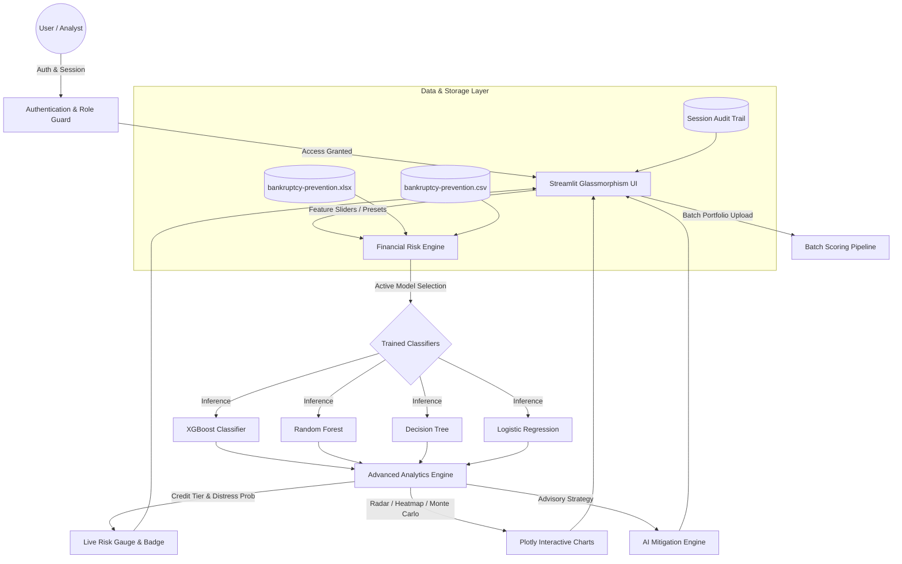

# 🛡️ FinShield AI: Enterprise Corporate Bankruptcy Risk Engine

FinShield is an enterprise-grade, machine learning-powered financial risk assessment and corporate distress prediction platform. By evaluating multi-dimensional qualitative and quantitative financial risk indicators, FinShield delivers real-time probability estimates, credit tier ratings (AAA to D), sensitivity heatmaps, and AI-driven mitigation roadmaps for investors, banks, and risk officers.

## 🚀 Key Features

- **🔐 Enterprise Authentication System**: Secure sign-in & registration with multi-role management (Financial Analyst, Risk Director, etc.) and 1-click demo guest access.
- **🧠 4 Machine Learning Models**: Benchmarking across **XGBoost Classifier**, **Random Forest**, **Decision Tree**, and **Logistic Regression**.
- **🏆 Credit Health Rating Tiers**: Automated tier scoring from **AAA** (Prime Solvency) down to **D** (Default Risk).
- **📊 2D Sensitivity Heatmaps**: Multi-variable interaction landscape displaying how simultaneous changes in two risk factors affect bankruptcy probability.
- **🎲 Monte Carlo Risk Simulations**: Run 100 to 2,000+ stochastic iterations with customizable market volatility to extract Value-at-Risk (95% VaR) and probability distributions.
- **📂 Batch Portfolio Processing**: Upload CSV/Excel corporate portfolios for bulk distress scoring, table visualization, and export.
- **💡 Executive Advisory Engine**: Automated strategic mitigation recommendations addressing specific identified vulnerabilities.
- **📋 Live User Audit Trail**: Historical session activity logging with one-click JSON export.

## 🏗️ Project Architecture


```mermaid
graph TD
    User((User / Analyst)) -->|Auth & Session| Login[Authentication & Role Guard]
    Login -->|Access Granted| UI[Streamlit Glassmorphism UI]
    
    UI -->|Feature Sliders / Presets| Engine[Financial Risk Engine]
    UI -->|Batch Portfolio Upload| Batch[Batch Scoring Pipeline]
    
    Engine -->|Active Model Selection| Models{Trained Classifiers}
    Models -->|Inference| XGB[XGBoost Classifier]
    Models -->|Inference| RF[Random Forest]
    Models -->|Inference| DT[Decision Tree]
    Models -->|Inference| LR[Logistic Regression]
    
    XGB --> Analytics[Advanced Analytics Engine]
    RF --> Analytics
    DT --> Analytics
    LR --> Analytics
    
    Analytics -->|Credit Tier & Distress Prob| Gauge[Live Risk Gauge & Badge]
    Analytics -->|Radar / Heatmap / Monte Carlo| Plotly[Plotly Interactive Charts]
    Analytics -->|Advisory Strategy| Advisor[AI Mitigation Engine]
    
    Gauge --> UI
    Plotly --> UI
    Advisor --> UI
    
    subgraph Data & Storage Layer
        Excel[(bankruptcy-prevention.xlsx)] --> Engine
        CSV[(bankruptcy-prevention.csv)] --> Engine
        History[(Session Audit Trail)] --> UI
    end
```

## 🛠️ Tech Stack

- **Frontend**: Streamlit, Custom CSS (Glassmorphism), Streamlit-Lottie
- **Machine Learning**: Scikit-Learn, XGBoost, Joblib
- **Data Science & Analytics**: Pandas, NumPy
- **Visualizations**: Plotly Express & Graph Objects
- **Language & Runtime**: Python 3.10+

## 📥 Installation & Setup

1. **Clone the repository**:
   ```bash
   git clone https://github.com/sujal971/FinShield.git
   cd FinShield
   ```

2. **Install dependencies**:
   ```bash
   pip install -r requirements.txt
   ```

3. **Launch the application**:
   ```bash
   streamlit run App.py
   ```

4. **Access in browser**:
   Open `http://localhost:8501` to access the dashboard.

## 👥 Contributors

| Name | Role |
| :--- | :--- |
| **Abhinay Patel** | Backend Developer & Architect Designer |
| **Sujal Gupta** | Frontend Developer & ML Engineer |

---
*Developed for professional financial risk management, credit assessment, and educational research.*
